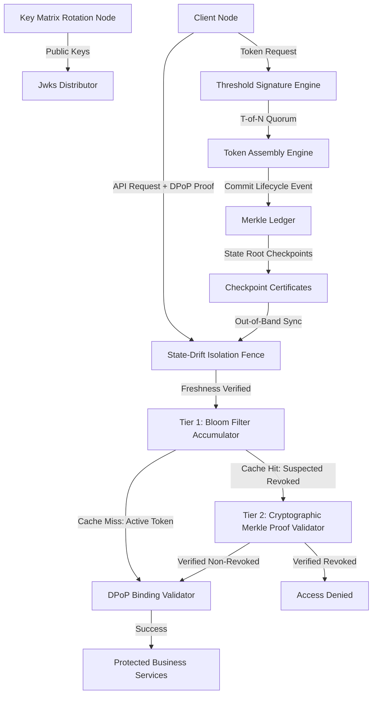
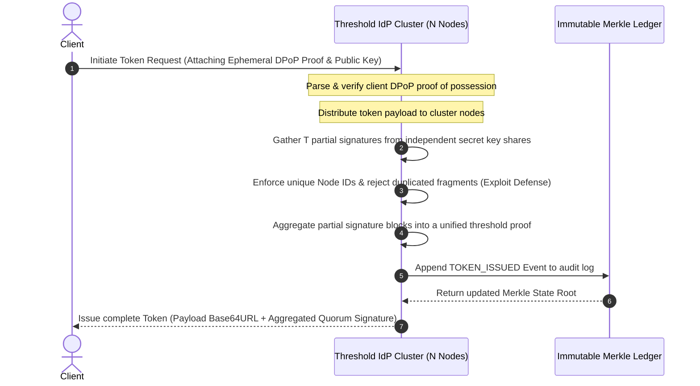
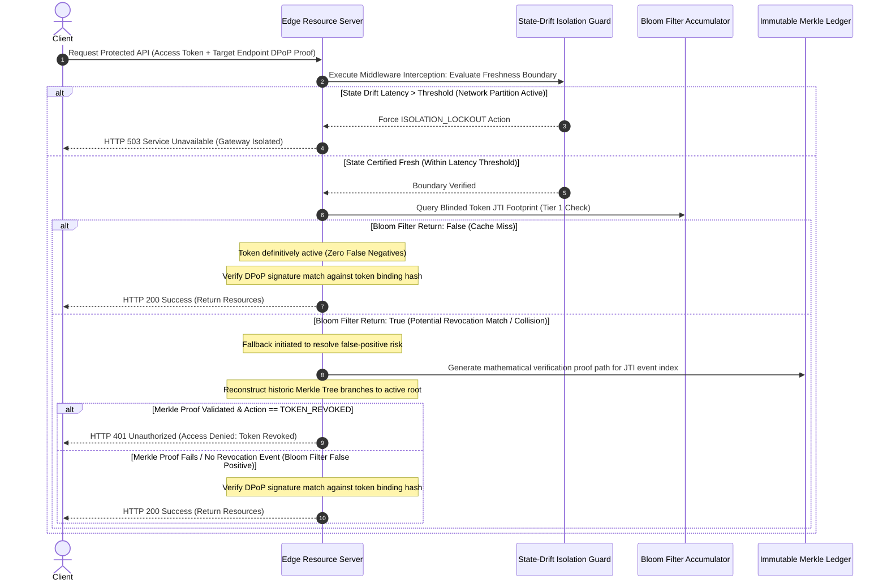

# Zero-Trust Token Authority (The Access Engine)

A production-grade Identity Provider (IdP) and decentralized edge gateway architecture simulation written in TypeScript. This system enforces cryptographic proof-of-possession binding, multi-authority threshold signing, immutable audit trail append logging, space-efficient fast-path revocation filtering, and temporal network isolation fences. It mitigates token theft, replay attacks, control-plane partitioning blindspots, and single-point-of-failure key compromise vectors found in standard JSON Web Token (JWT) infrastructures.

## Technical Architecture Overview

The system transitions authentication from a model of passive perimeter trust to continuous cryptographic validation across distributed infrastructure components. It is structured around six core primitives.



## Core Cryptographic Pillars

### Threshold Cryptographic Token Issuance

$T$-of-$N$ secret sharing eliminates single point of failure (SPOF) key compromises. The authoritative private key matrix is fragmented across $N$ isolated authority nodes. Generating a cryptographically valid token requires validation and partial signature fragments from a quorum of $T$ independent servers, which are combined out-of-band to assemble the token payload.

### Cryptographically Bound Tokens

DPoP proof-of-possession tokens are bound to the client's ephemeral private key via an asymmetric thumbprint confirmation structure (`cnf.jkt`). If an access token is intercepted over an insecure network boundary, it cannot be replayed by an adversary without possession of the matching client private key.

### Immutable State Ledger

A Merkle Tree ledger appends real-time lifecycle events such as issuance, revocation, and key transitions. This builds an audit log where any historic entry or state change can be mathematically verified against the current root hash via localized proof paths.

### Tiered Revocation Validation Matrix

This architecture balances low-latency edge performance with strict consistency.

- **Tier 1 (Fast-Path Caching):** A space-efficient, localized cryptographic Bloom Filter tracks revoked tokens. Cache misses immediately confirm the token is active with zero false-negative risk, avoiding expensive control-plane lookups.
- **Tier 2 (Cryptographic Fallback):** If a local filter collision occurs (a potential false positive), the gateway executes a historic verification check against the authoritative Merkle Ledger root state to determine absolute status.

### State-Drift Isolation Fence

Edge resource nodes are protected against state-freeze exploitation during control-plane network partitions. Edge gateways continuously monitor authoritative checkpoint heartbeats verified by an HMAC chain. If the latency delta since the last successful synchronization point crosses a strict time threshold, the gateway enters a secure lockout state and drops processing.

## Comprehensive Transaction Sequences

### 1. Multi-Authority Threshold Issuance



### 2. Edge Verification Pipeline with Network Partition Containment



## Component Specification

### Primitives Overview

- `src/primitives/threshold.ts`: Manages multi-authority cryptographic operations, generating independent secret fractions and aggregating $T$-of-$N$ signature tokens while preventing share duplication exploits.
- `src/primitives/checkpoint.ts`: Establishes the `StateDriftIsolationGuard` middleware layer, verifying incoming authority snapshots via HMAC chains and managing edge fail-secure lockout thresholds.
- `src/primitives/accumulator.ts`: Implements a deterministic Bloom Filter configured with multiple independent salting variations to track blinded tracking hashes within localized memory constraints.
- `src/primitives/ledger.ts`: An append-only Merkle Tree engine computing real-time state roots and outputting audit proof nodes.
- `src/primitives/tokens.ts`: Handles validation and mapping structures for DPoP proof-of-possession challenges and asymmetric thumbprints.

## Getting Started

### Prerequisites

- Node.js v20.x or higher
- npm v10.x or higher

### Installation

Clone the workspace to your local directory:

```bash
git clone https://github.com/Kefmat/zero-trust-token-authority
cd zero-trust-token-authority
```

Install the project dependencies:

```bash
npm install
```

### Running the Orchestration Suite

Compile the source code from TypeScript and execute the simulation pipeline using the unified execution manager:

```bash
npm start
```

## Simulation Execution Output Demo

The following log trace demonstrates the end-to-end execution of the architecture under normal operation and under simulated network attack vectors:

```text
=================================================
   Zero-Trust Token Authority: Access Engine
=================================================

[Ledger] Genesis State Hash: caef4bda766426eb49280a2ad2b9e51f3ac145c97f236e2b4300e391f6480bdd
[Ledger] Key Matrix Initialized. Merkle Root: 1d156b9f95f4ffa33f66e63d28f5fa85eaa3b7e24fcfde037a90bf1e6ede92e9
[Control Plane] Initial cryptographic boundary checkpoint broadcasted to remote gateways.
[IdP Cluster] Initialized 5 Independent Secret Share Keys. Quorum Threshold: 3

[Client] Generating ephemeral cryptographic proof-of-possession keys...
[Client] Generating DPoP proof for token issuance endpoint...
[IdP Cluster] Processing incoming token request and parsing proof framework...

[Simulation] Adversary compromises a single cluster node (NODE-SHARE-001) and attempts to forge an access token...
[Adversary] Forging signature component using compromised key fragment: NODE-SHARE-001
[IdP Cluster] Aggregating token signatures and validating security bounds...
[DEFENSE SUCCESS] Threshold engine blocked token assembly. Reason: QUORUM_FAILURE: Insufficient signature tokens. Gathered 1 unique shares, but a minimum of 3 is required.

[IdP Cluster] Routing authentic request across independent cluster nodes to collect quorum signatures...
[Cluster] Node NODE-SHARE-001 validated transaction and appended unique signature fragment.
[Cluster] Node NODE-SHARE-003 validated transaction and appended unique signature fragment.
[Cluster] Node NODE-SHARE-005 validated transaction and appended unique signature fragment.
[IdP Cluster] Aggregating consensus fragments...
[IdP Cluster] Quorum verified. Threshold-certified token successfully issued.
[Ledger] Event committed. Merkle Root updated to: fed37d5722d86c24b88e43d864433066ad2903a9f399fabe28934c87ac2d4633

[Client] Accessing protected business API with the threshold-certified token...
[Resource Server] Evaluating token payload and threshold signature validation matrices...
[Resource Server] Intercepting request pipeline: evaluating state freshness boundaries...
[Resource Server] Boundary State Certified Fresh. Continuing with token payload assessment...
[Resource Server] Fast-path complete: Local accumulator confirms token is active.
[Resource Server] Authorization Successful: Proof-of-Possession and Threshold Quorum confirmed.

[Simulation] Adversary cuts control plane data pipes to simulate an edge network partition...
[Simulation] IdP emits global revocation warning, but the isolated edge gateway is blocked from receiving it...
[Ledger] Revocation state committed. Global Merkle Root updated to: 237a1bcb106dd5f2f8b5b15eb2759a3758cb9b0876edc1fe1320fcecdc4b46b3
[Control Plane] Warning broadcast failed: Edge accumulator synchronization blocked.
[Simulation] Advancing baseline operational time forward by 4000 milliseconds...

[Client] Attempting to access protected API again across the partitioned boundary...
[Resource Server] Intercepting request pipeline: evaluating state freshness boundaries...
[DEFENSE SUCCESS] Resource Server successfully blocked access. Reason: ISOLATION_LOCKOUT: Edge state synchronization boundary has drifted by 4015ms. Control link unavailable. Gateway locked.

=================================================
         Final Cryptographic State Audit
=================================================
Final Merkle State Root: 237a1bcb106dd5f2f8b5b15eb2759a3758cb9b0876edc1fe1320fcecdc4b46b3
Total System Events Recorded Immutably: 3
=================================================
```
