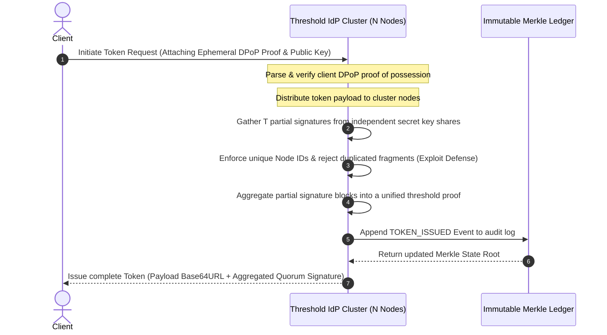
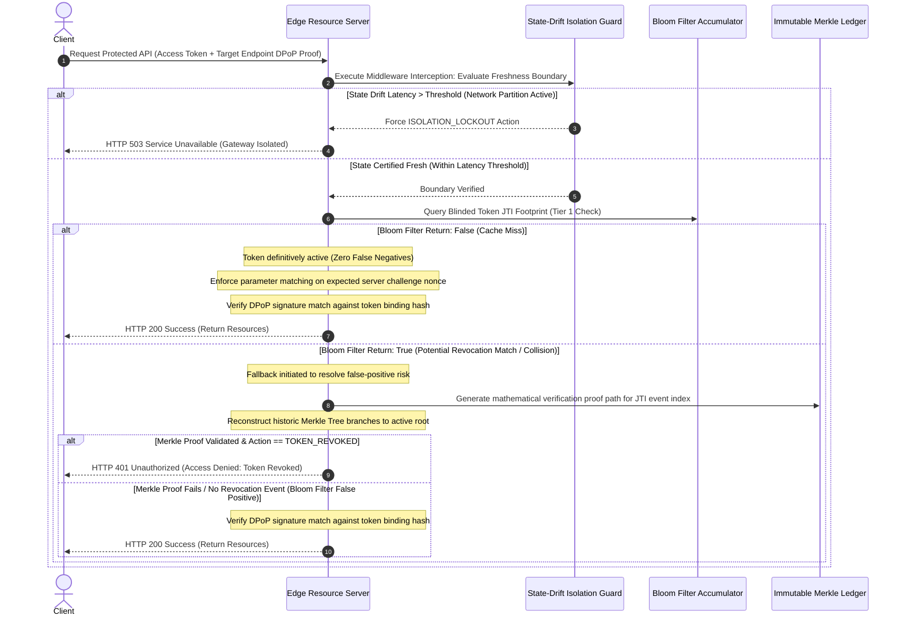

# Zero-Trust Token Authority (The Access Engine)

A production-grade Identity Provider (IdP) and decentralized edge gateway architecture simulation written in TypeScript. This system enforces cryptographic proof-of-possession binding, multi-authority threshold signing, immutable audit trail append logging, space-efficient fast-path revocation filtering, and temporal network isolation fences. It mitigates token theft, replay attacks, control-plane partitioning blindspots, and single-point-of-failure key compromise vectors found in standard JSON Web Token (JWT) infrastructures.

## Technical Architecture Overview

The system transitions authentication from a model of passive perimeter trust to continuous cryptographic validation across distributed infrastructure components. It is structured around six core primitives.


## Core Cryptographic Pillars

### Threshold Cryptographic Token Issuance

$T$-of-$N$ secret sharing eliminates single point of failure (SPOF) key compromises. The authoritative private key matrix is fragmented across $N$ isolated authority nodes. Generating a cryptographically valid token requires validation and partial signature fragments from a quorum of $T$ independent servers, which are combined out-of-band to assemble the token payload.

### Cryptographically Bound Tokens

DPoP proof-of-possession tokens are bound to the client's ephemeral private key via an asymmetric thumbprint confirmation structure (`cnf.jkt`). If an access token is intercepted over an insecure network boundary, it cannot be replayed by an adversary without possession of the matching client private key.

### Immutable State Ledger

A Merkle Tree ledger appends real-time lifecycle events such as issuance, revocation, and key transitions. This builds an audit log where any historic entry or state change can be mathematically verified against the current root hash via localized proof paths.

### Tiered Revocation Validation Matrix

This architecture balances low-latency edge performance with strict consistency.

- **Tier 1 (Fast-Path Caching):** A space-efficient, localized cryptographic Bloom Filter tracks revoked tokens. Cache misses immediately confirm the token is active with zero false-negative risk, avoiding expensive control-plane lookups.
- **Tier 2 (Cryptographic Fallback):** If a local filter collision occurs (a potential false positive), the gateway executes a historic verification check against the authoritative Merkle Ledger root state to determine absolute status.

### State-Drift Isolation Fence

Edge resource nodes are protected against state-freeze exploitation during control-plane network partitions. Edge gateways continuously monitor authoritative checkpoint heartbeats verified by an HMAC chain. If the latency delta since the last successful synchronization point crosses a strict time threshold, the gateway enters a secure lockout state and drops processing.

## Comprehensive Transaction Sequences

### 1. Multi-Authority Threshold Issuance



### 2. Edge Verification Pipeline with Network Partition Containment



## Component Specification

### Primitives Overview

- `src/primitives/threshold.ts`: Manages multi-authority cryptographic operations, generating independent secret fractions and aggregating $T$-of-$N$ signature tokens while preventing share duplication exploits.
- `src/primitives/checkpoint.ts`: Establishes the StateDriftIsolationGuard middleware layer, verifying incoming authority snapshots via HMAC chains and managing edge fail-secure lockout thresholds.
- `src/primitives/accumulator.ts`: Implements the RevocationAccumulator simulating a high-performance Cuckoo Filter matrix to evaluate cryptographic fingerprints within constant lookup boundaries while allowing memory reclamation.
- `src/primitives/ledger.ts`: An append-only Merkle Tree engine computing real-time state roots and outputting audit proof nodes.
- `src/primitives/nonce.ts`: Implements the stateless NonceEngine to issue and verify single-use server challenge nonces, binding validation sequences to the active client public key footprint.
- `src/primitives/tokens.ts`: Handles validation and mapping structures for DPoP proof-of-possession challenges and asymmetric thumbprints. Enforces structural type-safety definitions for token assertions that explicitly support strict compilation environments configuration matrices (such as exactOptionalPropertyTypes: true).

## Getting Started

### Prerequisites

- Node.js v20.x or higher
- npm v10.x or higher

### Installation

Clone the workspace to your local directory:

```bash
git clone https://github.com/Kefmat/zero-trust-token-authority
cd zero-trust-token-authority
```

Install the project dependencies:

```bash
npm install
```

### Running the Orchestration Suite

Compile the source code from TypeScript and execute the simulation pipeline using the unified execution manager:

```bash
npm start
```

## Simulation Execution Output Demo

The following log trace demonstrates the end-to-end execution of the architecture under normal operation and under simulated network attack vectors:

```text
=================================================
   Zero-Trust Token Authority: Access Engine     
=================================================

[Client] Generating ephemeral cryptographic proof-of-possession keys...
[Client] Generating DPoP proof for token issuance endpoint...
[IdP Cluster] Processing incoming token request and parsing proof framework...
[IdP Cluster] Quorum verified. Threshold-certified token successfully issued.

[Client] Accessing protected business API with the threshold token...
[Client -> Server] Sending request payload...
[Resource Server] Evaluating request properties...
[DEFENSE INTERCEPT] Access Denied. Reason: DPoP proof missing server-injected nonce.
[Resource Server -> Client] Emitting HTTP 401 Challenge with fresh DPoP-Nonce header.

[Client] Extracting server-issued nonce token and constructing fresh DPoP proof context...
[Client -> Server] Re-submitting request with nonce-bound DPoP confirmation...
[Resource Server] Intercepting pipeline: evaluating state boundaries and proof nonces...
[Resource Server] Nonce signature verified and bound to active client thumbprint.
[Resource Server] Authorization Successful: Handshake validated, access granted.

[Simulation] Adversary captures the client's previous DPoP proof and attempts an immediate replay...
[Simulation] Adversary targets a different resource server node or context using the same nonce token...
[Resource Server] Intercepting adversarial pipeline request...
[DEFENSE SUCCESS] Resource Server blocked threat. Reason: Nonce binding validation failed: Client thumbprint mismatch.

=================================================
         Final Cryptographic State Audit         
=================================================
Final Merkle State Root: caef4bda766426eb49280a2ad2b9e51f3ac145c97f236e2b4300e391f6480bdd
=================================================
```
